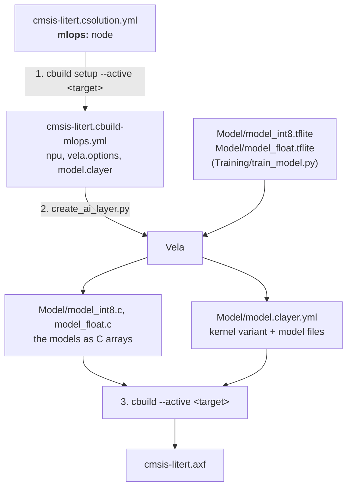

# The MLOps flow

The `mlops:` node in `cmsis-litert.csolution.yml` is the central definition
of the Ethos-U target for this example. It follows the CMSIS-Toolbox
[MLOps information](https://open-cmsis-pack.github.io/cmsis-toolbox/build-overview/#mlops-information)
specification. This document explains how the three build steps use and
propagate that information.



## 1. `cbuild setup` turns the csolution into `*.cbuild-mlops.yml`

The csolution is the only place where the NPU is described:

```yaml
solution:
  mlops:
    description: Hello World sine model for Ethos-U85
    npu:
      type: Ethos-U85
      macs: 256                        # the SSE-320 BSP declares no NPU features
    vela:
      system: Ethos_U85_SYS_DRAM_Mid   # system-config from the Vela config
      memory: Shared_Sram              # memory-mode from the Vela config
    model:
      clayer: ./Model/model.clayer.yml
      name: HelloWorld
    simulator:
      target: SSE-320-U85              # <target-type>[@<target-set>] of the FVP
```

`cbuild setup cmsis-litert.csolution.yml --active SSE-320-U85` resolves
it for the active target and writes `cmsis-litert.cbuild-mlops.yml`:

```yaml
cbuild-mlops:
  generated-by: csolution version 2.14.1+p38-gf512b381
  description: Hello World sine model for Ethos-U85
  processor:
    type: Cortex-M85
  npu:
    type: Ethos-U85
    macs: 256
  vela:
    options: --accelerator-config ethos-u85-256 --system-config Ethos_U85_SYS_DRAM_Mid --memory-mode Shared_Sram
  model:
    clayer: Model/model.clayer.yml
    name: HelloWorld
  simulator:
    active: SSE-320-U85
    cbuild-run: out/cmsis-litert+SSE-320-U85.cbuild-run.yml
    output:
      - file: out/cmsis-litert/SSE-320-U85/Debug/cmsis-litert.axf
        type: elf
    model: ${workspaceFolder}/.vscode/fvp.sh
    config-file: board/Corstone-320/fvp_config.txt
```

The `simulator:` section is what a test runner needs to execute the image on
the FVP.

This is the hand-over point to the MLOps side: everything a model pipeline
needs to know about the target is in this one file. For a device whose DFP
describes its NPU, `npu:` and `vela.ini` are filled in from the pack and can be
left out of the csolution; for a target without an NPU the `npu:` and `vela:`
nodes are absent.

`cbuild setup` writes the file even when the AI layer does not exist yet, so
the flow also works on a checkout without a generated layer.

## 2. `create_ai_layer.py` turns `*.cbuild-mlops.yml` into the AI layer

`python create_ai_layer.py cmsis-litert.cbuild-mlops.yml` stands in for an
MLOps system. It reads the file and:

1. runs Vela on `Model/model_int8.tflite` with exactly the options from
   `vela.options` (plus `--config` when the file names a `vela.ini`); the Python
   code contains no NPU configuration. The step fails if Vela leaves an
   operator on the CPU: this example runs the int8 model entirely on the NPU
   (the resolver registers FullyConnected for the float model and the Ethos-U
   operator for the int8 one, not the CMSIS-NN fallback for a partly delegated
   graph). Without an `npu:` node the int8 model is used as trained;
2. writes the layer into the directory of `model.clayer`:

| File | Content |
|------|---------|
| `Model/model.clayer.yml` | the TensorFlow Lite Micro kernels for the target (`Kernel&Ethos-U` or `Kernel&CMSIS-NN`), their helper packs, `CMSIS:NN Lib`, and the two model files |
| `Model/model_int8.c` | `model_int8_tflite[]` / `model_int8_tflite_len`, 16-byte aligned, Vela-compiled for the NPU |
| `Model/model_float.c` | `model_float_tflite[]` / `model_float_tflite_len`, the float model for the CPU |
| `Model/model_int8_vela.tflite` | Vela's output, kept for inspection (not committed) |

The pack has one kernel component per variant rather than one per operator,
so selecting the variant is the whole "component selection" for a TensorFlow
Lite Micro model. The Ethos-U variant compiles the CMSIS-NN kernels as well but
does not declare the dependency on `CMSIS:NN Lib`, which is why the layer
selects that library explicitly.

## 3. `cbuild` builds the application

`cbuild cmsis-litert.csolution.yml --active SSE-320-U85` is a plain CMSIS
build without any Python. The cproject knows nothing about the model: it
lists the application source and the two layers, and the AI layer contributes
both the kernel selection and the model data. The layer and the C arrays are
committed, so a checkout builds without Python.

The application registers `FullyConnected` and, through `AddEthosU()`, the
Ethos-U operator. The latter is a no-op when the CMSIS-NN kernel variant is
built, so the same source serves both layer variants.

## Changing the model or the target

- **Another model:** retrain with `Training/train_model.py` (or drop your own
  `.tflite` files into `Model/`), run steps 2 and 3.
- **Another NPU configuration:** edit the `mlops:` node (and add the matching
  `target-types:` entry and board layer), run steps 1 to 3:

  ```yaml
  mlops:
    npu:
      type: Ethos-U55          # was Ethos-U85
      macs: 128
    vela:
      system: Ethos_U55_High_End_Embedded
      memory: Shared_Sram
  ```

  The Python side needs no changes at all.
- **A target without an NPU:** leave out `npu:` and `vela:`; step 2 then writes
  the CMSIS-NN variant of the layer and the int8 model as trained.
